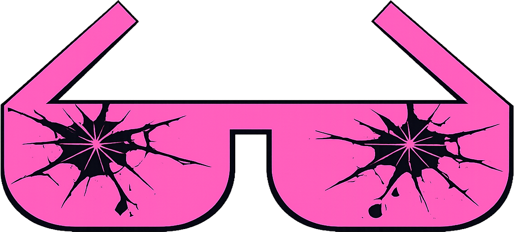

  

# awesome-useless ✨

A curated list of awesome useless code, tools, and resources. 
Contributions welcome. Useful PRs will be rejected.

🏆 An entry in the [DEV April Fools Challenge](https://dev.to/challenges/april-fools) · `#418challenge` · `#devchallenge`

---

## Contents

- [Tools](#tools)
- [Projects](#projects)
- [Prompts](#prompts)
- [Spells](#spells)

---

## 🛠️ Tools

- [oh-my-silly-me](oh-my-silly-me/) — A shell framework for the unproductive. Like oh-my-zsh but worse in every measurable way.

## 🏛️ Projects

- [devCities.lol](owls-witsec/) — Your dev portfolio. In 1997. A government owl builds your Devcities homepage from a prompt.

## 🧠 Prompts

- [unhinged-prompts](unhinged-prompts/) — AI prompts that should not exist. Curated by someone who regrets all of them.

## 🧙 Spells

- [.spells](.spells/) — A hidden grimoire. `ls -la` and you'll see things. We cannot be held responsible.

---

## Contributing

**Submit your own useless project via PR.**
Agent Hoot will review it....takes a while.
It will be worth it.

We welcome contributions that are:

- ✅ Useless
- ✅ Silly
- ✅ Over-engineered for no reason
- ✅ Solving problems that do not exist
- ✅ Agentic loops that accomplish nothing
- ✅ Multi-agent systems with zero output
- ✅ AI pipelines that run forever and return "fine"
- ✅ Autonomous agents that autonomously do nothing

We do not accept contributions that are:

- ❌ Useful
- ❌ Practical
- ❌ Something your employer would approve of
- ❌ Written in Tailwind CSS

---

## Hall of Fame

_Be the first outsider to submit something useless._

| Project           | Uselessness Score | Agent Hoot Approval |
| ----------------- | ----------------- | ------------------- |
| oh-my-silly-me    | ████████░░ 99%    | 🦉 reluctantly      |
| devCities.lol     | ██████████ 100%   | 🦉 with great pride |
| your project here | ░░░░░░░░░░ ???%   | 🦉 pending review   |

_Submit a PR. Add your project. Agent Hoot will judge it._
_Agent Hoot's judgment is final._

---

## License

WTFPL — Do What The F\*\*\* You Want To Public License.
Agent Hoot has reviewed this license.
Agent Hoot has concerns.
Agent Hoot's concerns are classified.

---

_This list is curated with absolutely no regard for your productivity._

_If this repository has helped you in any way, something has gone terribly wrong._

_Please open an issue._
